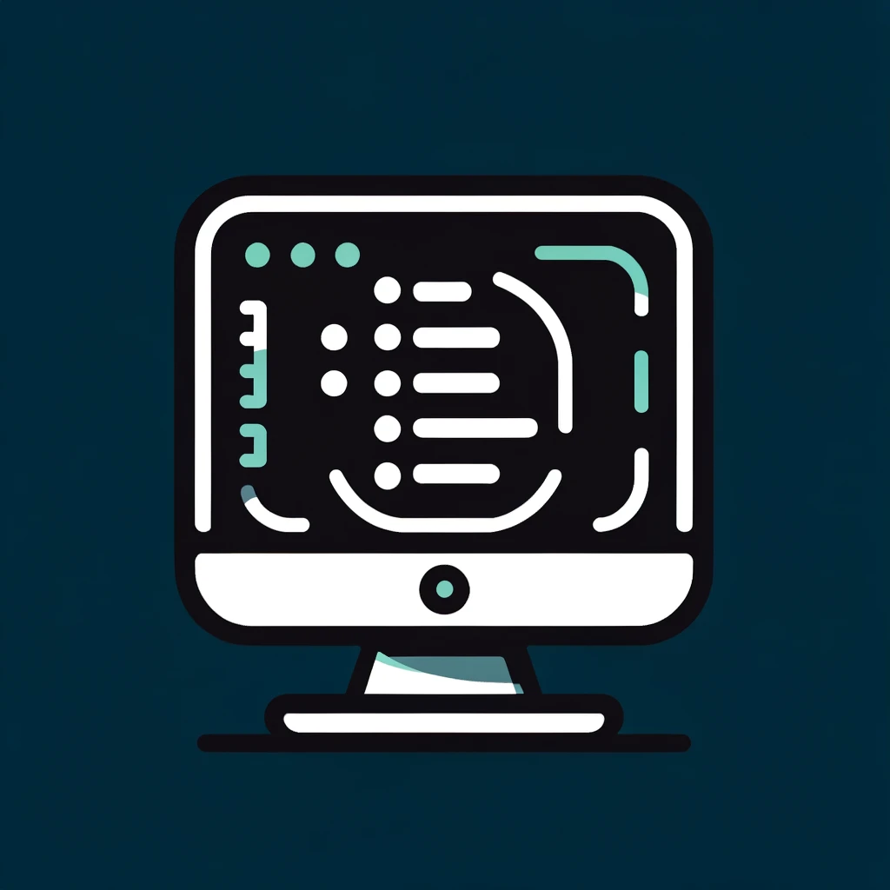

<!-- Improved compatibility of back to top link: See: https://github.com/othneildrew/Best-README-Template/pull/73 -->
<a name="readme-top"></a>
<!--
*** Thanks for checking out the Best-README-Template. If you have a suggestion
*** that would make this better, please fork the repo and create a pull request
*** or simply open an issue with the tag "enhancement".
*** Don't forget to give the project a star!
*** Thanks again! Now go create something AMAZING! :D
-->


<!-- PROJECT SHIELDS -->
<!--
*** I'm using markdown "reference style" links for readability.
*** Reference links are enclosed in brackets [ ] instead of parentheses ( ).
*** See the bottom of this document for the declaration of the reference variables
*** for contributors-url, forks-url, etc. This is an optional, concise syntax you may use.
*** https://www.markdownguide.org/basic-syntax/#reference-style-links
-->
[![Contributors][contributors-shield]][contributors-url]
[![Forks][forks-shield]][forks-url]
[![Stargazers][stars-shield]][stars-url]
[![Issues][issues-shield]][issues-url]
[![MIT License][license-shield]][license-url]
[![LinkedIn][linkedin-shield]][linkedin-url]


<!-- PROJECT LOGO -->
<br />
<div align="center">
  <a href="https://github.com/Mindful-Developer/terminal-menu">
    
  </a>

  <h3 align="center">PROJECT TEMPLATES</h3>

  <p align="center">
    A collection of project templates to help you get started on your next project!
    <br />
    <a href="https://github.com/Mindful-Development/terminal-menu"><strong>Explore the docs »</strong></a>
    <br />
    <br />
    <a href="https://github.com/Mindful-Developer/terminal-menu">View Demo</a>
    ·
    <a href="https://github.com/Mindful-Developer/terminal-menu/issues">Report Bug</a>
    ·
    <a href="https://github.com/Mindful-Developer/terminal-menu/issues">Request Feature</a>
  </p>
</div>


<!-- TABLE OF CONTENTS -->
<details>
  <summary>Table of Contents</summary>
  <ol>
    <li>
      <a href="#about-the-project">About The Project</a>
      <ul>
        <li><a href="#built-with">Built With</a></li>
      </ul>
    </li>
    <li>
      <a href="#getting-started">Getting Started</a>
      <ul>
        <li><a href="#prerequisites">Prerequisites</a></li>
        <li><a href="#installation">Installation</a></li>
      </ul>
    </li>
    <li><a href="#usage">Usage</a></li>
    <li><a href="#roadmap">Roadmap</a></li>
    <li><a href="#contributing">Contributing</a></li>
    <li><a href="#license">License</a></li>
    <li><a href="#contact">Contact</a></li>
    <li><a href="#acknowledgments">Acknowledgments</a></li>
  </ol>
</details>


<!-- ABOUT THE PROJECT -->
## About The Project

This project provides various terminal elements that can be used to create a terminal menu. It is designed to be used with the [Python](https://www.python.org/) programming language, but can be used with any language that can run Python scripts. The different prompts include a question, select, multi-select and a message prompt. There are also convenience functions like scroll_clear and clear for clearing the terminal screen.

This is still a work in progress, but I will be adding more prompts and functionality as I go. Feel free to contribute!

<p align="right">(<a href="#readme-top">back to top</a>)</p>


<!-- GETTING STARTED -->
## Getting Started

The only requirement for this project is a semi-newer version of Python. You can download the latest version [here](https://www.python.org/downloads/).


### Prerequisites

* Python 3.10+

Check your version using
```sh
python --version
```

### Installation

1. clone the repo 
```sh
git clone https://github.com/Mindful-Developer/terminal-menu.git
```
2. Install Python packages
```sh
pip install -r requirements.txt
```

<p align="right">(<a href="#readme-top">back to top</a>)</p>


<!-- USAGE EXAMPLES -->
## Usage

Use this space to show useful examples of how a project can be used. Additional screenshots, code examples and demos work well in this space. You may also link to more resources.

_For more examples, please refer to the [Documentation](https://example.com)_

<p align="right">(<a href="#readme-top">back to top</a>)</p>


[//]: # (<!-- ROADMAP -->)

[//]: # (## Roadmap)

[//]: # ()
[//]: # (- [x] Add Changelog)

[//]: # (- [x] Add back to top links)

[//]: # (- [ ] Add Additional Templates w/ Examples)

[//]: # (- [ ] Add "components" document to easily copy & paste sections of the readme)

[//]: # (- [ ] Multi-language Support)

[//]: # (    - [ ] Chinese)

[//]: # (    - [ ] Spanish)

[//]: # ()
[//]: # (See the [open issues]&#40;https://github.com/othneildrew/Best-README-Template/issues&#41; for a full list of proposed features &#40;and known issues&#41;.)

[//]: # ()
[//]: # (<p align="right">&#40;<a href="#readme-top">back to top</a>&#41;</p>)


<!-- CONTRIBUTING -->
## Contributing

Contributions are what make the open source community such an amazing place to learn, inspire, and create. Any contributions you make are **greatly appreciated**.

If you have a suggestion that would make this better, please fork the repo and create a pull request. You can also simply open an issue with the tag "enhancement".
Don't forget to give the project a star! Thanks again!

1. Fork the Project
2. Create your Feature Branch (`git checkout -b feature/AmazingFeature`)
3. Commit your Changes (`git commit -m 'Add some AmazingFeature'`)
4. Push to the Branch (`git push origin feature/AmazingFeature`)
5. Open a Pull Request

<p align="right">(<a href="#readme-top">back to top</a>)</p>


<!-- LICENSE -->
## License

Distributed under the MIT License. See `LICENSE.txt` for more information.

<p align="right">(<a href="#readme-top">back to top</a>)</p>


<!-- CONTACT -->
## Contact

Chris James - [mindful.d3v@gmail.com](mindful.d3v@gmail.com)

Project Link: [https://github.com/Mindful-Developer/terminal-menu](https://github.com/Mindful-Developer/terminal-menu)

<p align="right">(<a href="#readme-top">back to top</a>)</p>


<!-- ACKNOWLEDGMENTS -->
## Acknowledgments

Use this space to list resources you find helpful and would like to give credit to. I've included a few of my favorites to kick things off!

* [Choose an Open Source License](https://choosealicense.com)
* [Img Shields](https://shields.io)

<p align="right">(<a href="#readme-top">back to top</a>)</p>


<!-- MARKDOWN LINKS & IMAGES -->
<!-- https://www.markdownguide.org/basic-syntax/#reference-style-links -->
[contributors-shield]: https://img.shields.io/github/contributors/Mindful-Developer/terminal-menu.svg?style=for-the-badge
[contributors-url]: https://github.com/Mindful-Developer/terminal-menu/graphs/contributors
[forks-shield]: https://img.shields.io/github/forks/Mindful-Developer/terminal-menu.svg?style=for-the-badge
[forks-url]: https://github.com/othneildrew/Best-README-Template/network/members
[stars-shield]: https://img.shields.io/github/stars/Mindful-Developer/terminal-menu.svg?style=for-the-badge
[stars-url]: https://github.com/Mindful-Developer/terminal-menu/stargazers
[issues-shield]: https://img.shields.io/github/issues/Mindful-Developer/terminal-menu.svg?style=for-the-badge
[issues-url]: https://github.com/Mindful-Developer/terminal-menu/issues
[license-shield]: https://img.shields.io/github/license/Mindful-Developer/terminal-menu.svg?style=for-the-badge
[license-url]: https://github.com/Mindful-Developer/terminal-menu/blob/master/LICENSE.txt
[linkedin-shield]: https://img.shields.io/badge/-LinkedIn-black.svg?style=for-the-badge&logo=linkedin&colorB=555
[linkedin-url]: https://linkedin.com/in/christopher-james-96a7911b3
[product-screenshot]: images/screenshot.png
[Next.js]: https://img.shields.io/badge/next.js-000000?style=for-the-badge&logo=nextdotjs&logoColor=white
[Next-url]: https://nextjs.org/
[React.js]: https://img.shields.io/badge/React-20232A?style=for-the-badge&logo=react&logoColor=61DAFB
[React-url]: https://reactjs.org/
[Vue.js]: https://img.shields.io/badge/Vue.js-35495E?style=for-the-badge&logo=vuedotjs&logoColor=4FC08D
[Vue-url]: https://vuejs.org/
[Angular.io]: https://img.shields.io/badge/Angular-DD0031?style=for-the-badge&logo=angular&logoColor=white
[Angular-url]: https://angular.io/
[Svelte.dev]: https://img.shields.io/badge/Svelte-4A4A55?style=for-the-badge&logo=svelte&logoColor=FF3E00
[Svelte-url]: https://svelte.dev/
[Laravel.com]: https://img.shields.io/badge/Laravel-FF2D20?style=for-the-badge&logo=laravel&logoColor=white
[Laravel-url]: https://laravel.com
[Bootstrap.com]: https://img.shields.io/badge/Bootstrap-563D7C?style=for-the-badge&logo=bootstrap&logoColor=white
[Bootstrap-url]: https://getbootstrap.com
[JQuery.com]: https://img.shields.io/badge/jQuery-0769AD?style=for-the-badge&logo=jquery&logoColor=white
[JQuery-url]: https://jquery.com 
